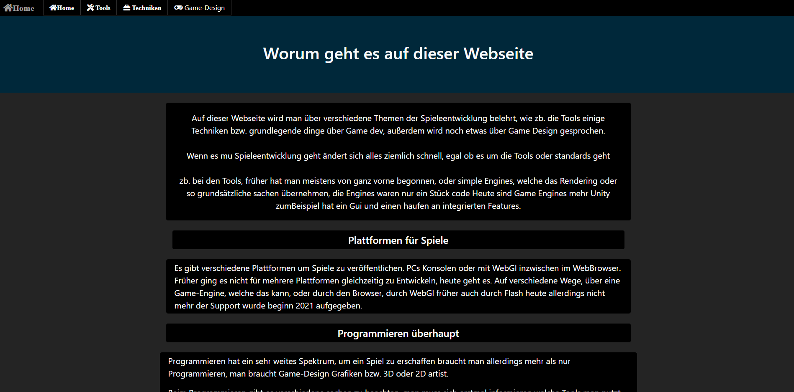
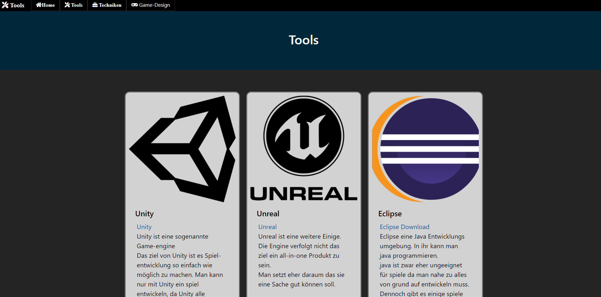
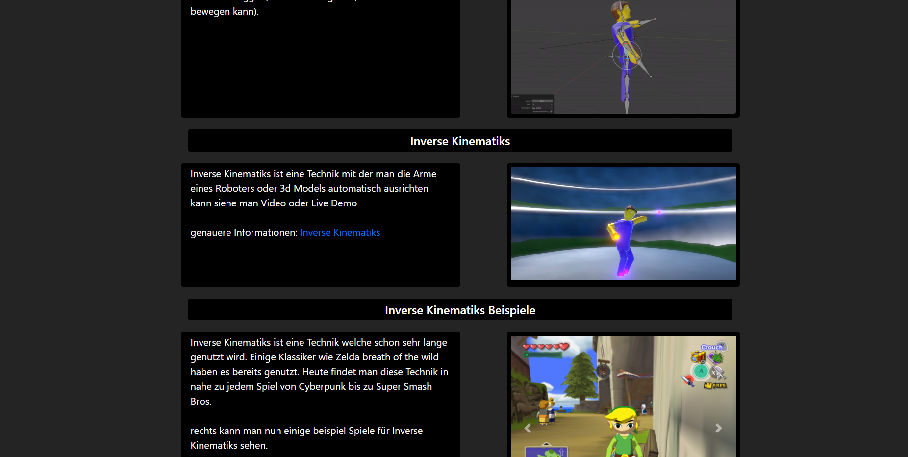
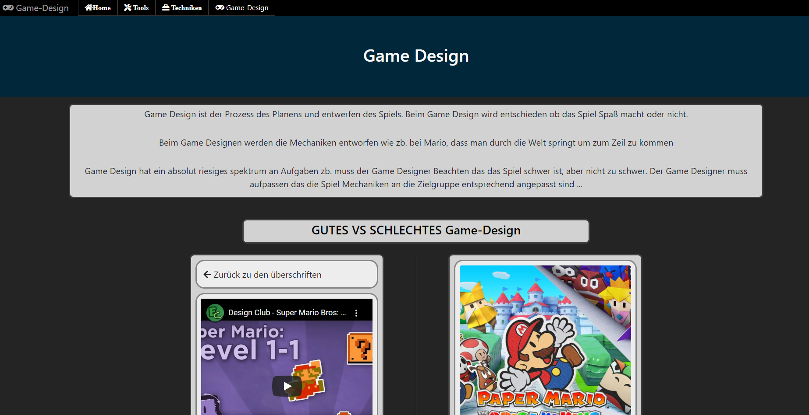

# Tinf Project 2020

This little Website was my Tinf Project 2020.
In this Project, i had to prove my knowledge of html, css, and java Script

This Website has Game Development as it´s topic.

- Motivation
- External Tools
- Learnings
- Description

## Motivation

My Motivation was simply to get a good grade and to improve my skills.

## Learnings

- html
- css
- js
- bootstrap

## External Tools
- html
- css
- js
- bootstrap 4
- unity
- Blender

## Description

The first page simply describes what the site is about.

The second page shows some card elements with information.

The third page has some cool features, but the cooles one is the embedded webGL Content. It demostrates IK 

The last page shows some information in a special form.

